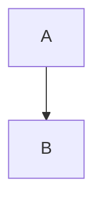

# Sample Title

This is a **bold** statement with *emphasis*.

- Item 1
- Item 2

```js
console.log("Hello, world!");
```

An emoji: :satellite:

A Subscript: H~2~0

A Superscript: 29^th^

A formula: $E = mc^2$

A footnote:

Here is a footnote reference,[^1] and another.[^longnote]

[^1]: Here is the footnote.

[^longnote]: Here's one with multiple blocks.

    Subsequent paragraphs are indented to show that they
belong to the previous footnote.

A warning container:

::: warning
*here be dragons*
:::

A spoiler container:

::: spoiler click me
*content*
:::

A Tasklist:

- [ ] Item1
- [x] Item1
- [ ] Item1

A Mermaid diagram:


