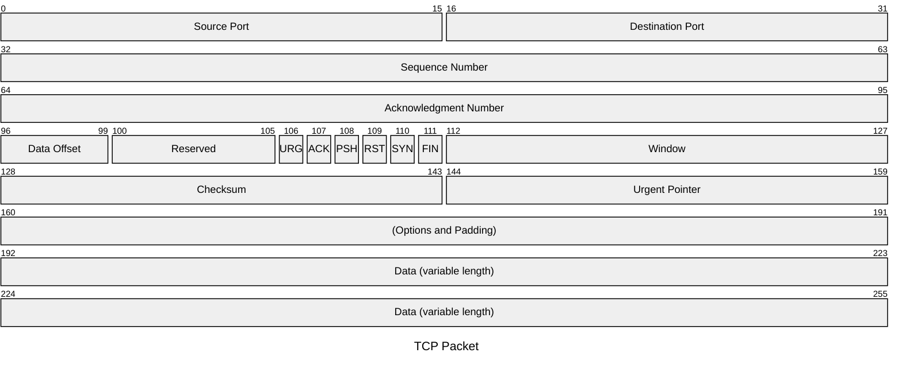

# H1 Header

- [H2 Header](#h2-header)
  - [H3 Header](#h3-header)
    - [H4 Header](#h4-header)
- [Text Styling](#text-styling)
- [Lists](#lists)
  - [Unordered](#unordered)
  - [Ordered](#ordered)
- [Task List](#task-list)
- [Links](#links)
- [Images](#images)
- [Code](#code)
  - [Inline `code`](#inline-code)
  - [Code block](#code-block)
- [Tables](#tables)
- [Horizontal Rule](#horizontal-rule)
- [Emoji](#emoji)
- [HTML Content](#html-content)
- [Footnotes](#footnotes)
  - [Single Line Footnote](#single-line-footnote)
  - [Multiple Lines Footnote](#multiple-lines-footnote)
- [Subscript and Superscript](#subscript-and-superscript)
- [Containers](#containers)
  - [Tip container](#tip-container)
  - [Info container](#info-container)
  - [Warning container](#warning-container)
  - [Spoiler container](#spoiler-container)
- [Pagebreak](#pagebreak)
- [Mermaid Diagram](#mermaid-diagram)
- [PlantUML Diagram](#plantuml-diagram)
- [Solving a System of Linear Equations](#solving-a-system-of-linear-equations)
  - [Step 1: Multiply the second equation by 3](#step-1-multiply-the-second-equation-by-3)
  - [Step 2: Add the two equations](#step-2-add-the-two-equations)
  - [Step 3: Solve for $x$](#step-3-solve-for-x)
  - [Step 4: Substitute x back into the first equation](#step-4-substitute-x-back-into-the-first-equation)
  - [✅ Final Answer](#-final-answer)

::: page-break
:::

## H2 Header

### H3 Header

#### H4 Header

##### H5 Header

###### H6 Header

## Text Styling

This is **bold** text.  
This is *italic* text.  
This is ***bold and italic*** text.  
This is ~~strikethrough~~ text.  
This is `inline code`.

> This is a blockquote.
>> Nested blockquote.

## Lists

### Unordered

- Item 1
- Item 2
  - Subitem 2.1
  - Subitem 2.2

### Ordered

1. First item
2. Second item
   1. Subitem 2.1
   2. Subitem 2.2

::: page-break
:::

## Task List

- [ ] Unchecked task
- [x] Checked task

## Links

Inline link: [OpenAI](https://www.openai.com)  
Reference-style link: [Google][1]  
Autolink: <https://example.com>

[1]: https://www.google.com

## Images


::: page-break
:::

## Code

### Inline `code`

Inline `code` in a sentence.

### Code block

````js
// JavaScript example
function greet(name) {
  console.log(`Hello, ${name}!`);
}
greet("World");
````

```bash
# Bash example
echo "Hello, terminal!"
```

## Tables

| Syntax | Description |
|--------|-------------|
| Header | Title       |
| Cell   | Data        |

## Horizontal Rule

## Emoji

Here is a smiley 😄  
Here is a rocket 🚀  
Here is an antenna: 📡

## HTML Content

<div style="color: red; font-weight: bold;">This is a styled div using raw HTML</div>

::: page-break
:::

## Footnotes

### Single Line Footnote

Here is a footnote reference.[^1]

[^1]: This is the footnote.

### Multiple Lines Footnote

Here is a long footnote reference.[^longnote]

[^longnote]: Here's one with multiple blocks.
    Subsequent paragraphs are indented to show that they belong to the previous footnote.
    Like So.

## Subscript and Superscript

Subscript: H~2~O  
Superscript: 29^th^

## Containers

### Tip container

::: tip
*Don't forget*
:::

### Info container

::: info
You are beautiful!
:::

### Warning container

::: warning
**He's coming for you!**
:::

### Spoiler container

::: spoiler HIDDEN SURPRISE
*Gotcha!*
:::

## Pagebreak

::: page-break
:::

## Mermaid Diagram



## PlantUML Diagram

@startuml
clock   "Clock_0"   as C0 with period 50
clock   "Clock_1"   as C1 with period 50 pulse 15 offset 10
binary  "Binary"  as B
concise "Concise" as C
robust  "Robust"  as R
analog  "Analog"  as A

@0
C is Idle
R is Idle
A is 0

@100
B is high
C is Waiting
R is Processing
A is 3

@300
R is Waiting
A is 1
@enduml

::: page-break
:::

## Solving a System of Linear Equations

Here is an example of inline math:

The slope of the line is given by $m = \frac{y_2 - y_1}{x_2 - x_1}$.

Now let's write a system of equations using KaTeX display math:

$$
\begin{aligned}
2x + 3y &= 6 \\
4x - y &= 5
\end{aligned}
$$

### Step 1: Multiply the second equation by 3

$$
\begin{aligned}
2x + 3y &= 6 \\
12x - 3y &= 15
\end{aligned}
$$

### Step 2: Add the two equations

$$
\begin{aligned}
(2x + 3y) + (12x - 3y) &= 6 + 15 \\
14x &= 21
\end{aligned}
$$

### Step 3: Solve for $x$

$$
x = \frac{21}{14} = \frac{3}{2}
$$

### Step 4: Substitute x back into the first equation

$$
2\left(\frac{3}{2}\right) + 3y = 6
$$

$$
3 + 3y = 6 \Rightarrow 3y = 3 \Rightarrow y = 1
$$

### ✅ Final Answer

$$
\boxed{x = \frac{3}{2},\quad y = 1}
$$
